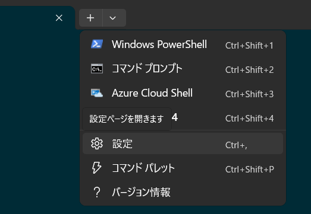
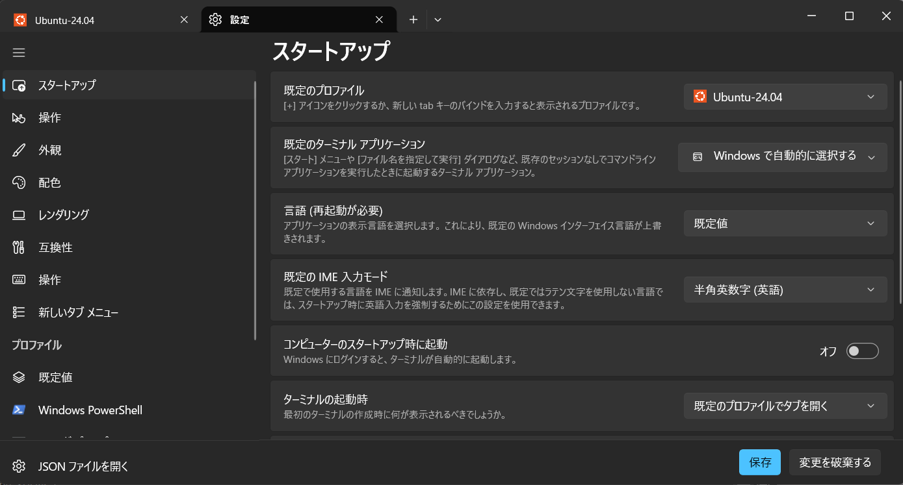

# Claude Code で Shift+Enter 改行を有効にする

前提:

- Windows 11
- Windows Terminal
- Claude Code

## 概要

Claude Code のチャット入力欄は、既定では `Enter` でそのまま送信される。

Windows Terminal の `settings.json` にキーバインドを追加すると、`Shift+Enter` で改行できるようになる。

## 手順

### 1. `settings.json` を開く

Windows Terminal を開き、`+` ボタン > `設定` と進む。


設定画面の左下にある `JSON ファイルを開く` から `settings.json` を開く。


### 2. `actions` に改行送信用のアクションを追加する

`actions` 配列に以下を追加する。

```json
{
  "command": {
    "action": "sendInput",
    "input": "\n"
  },
  "id": "User.sendNewLineInput"
}
```

### 3. `keybindings` に `Shift+Enter` を割り当てる

`keybindings` 配列に以下を追加する。

```json
{
  "id": "User.sendNewLineInput",
  "keys": "shift+enter"
}
```

### 4. 保存して確認する

`settings.json` を保存して Windows Terminal を再起動する。

Claude Code 上で `Shift+Enter` を押して、改行できることを確認する。

## 補足

- Windows Terminal のバージョンによっては、`keybindings` ではなく `actions` 内に `keys` を直接書く形式の場合がある。
- この設定は Windows Terminal 全体に適用されるため、PowerShell や `cmd` でも `Shift+Enter` が同様に動作する。
